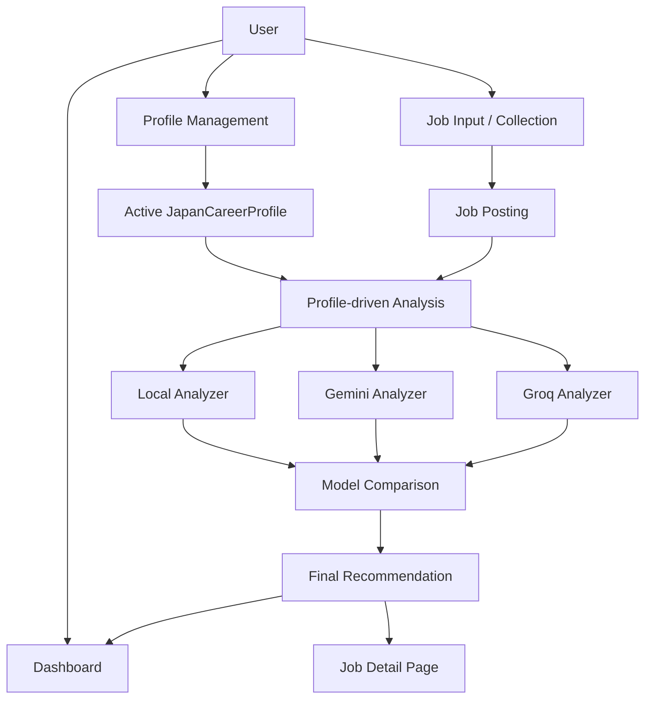
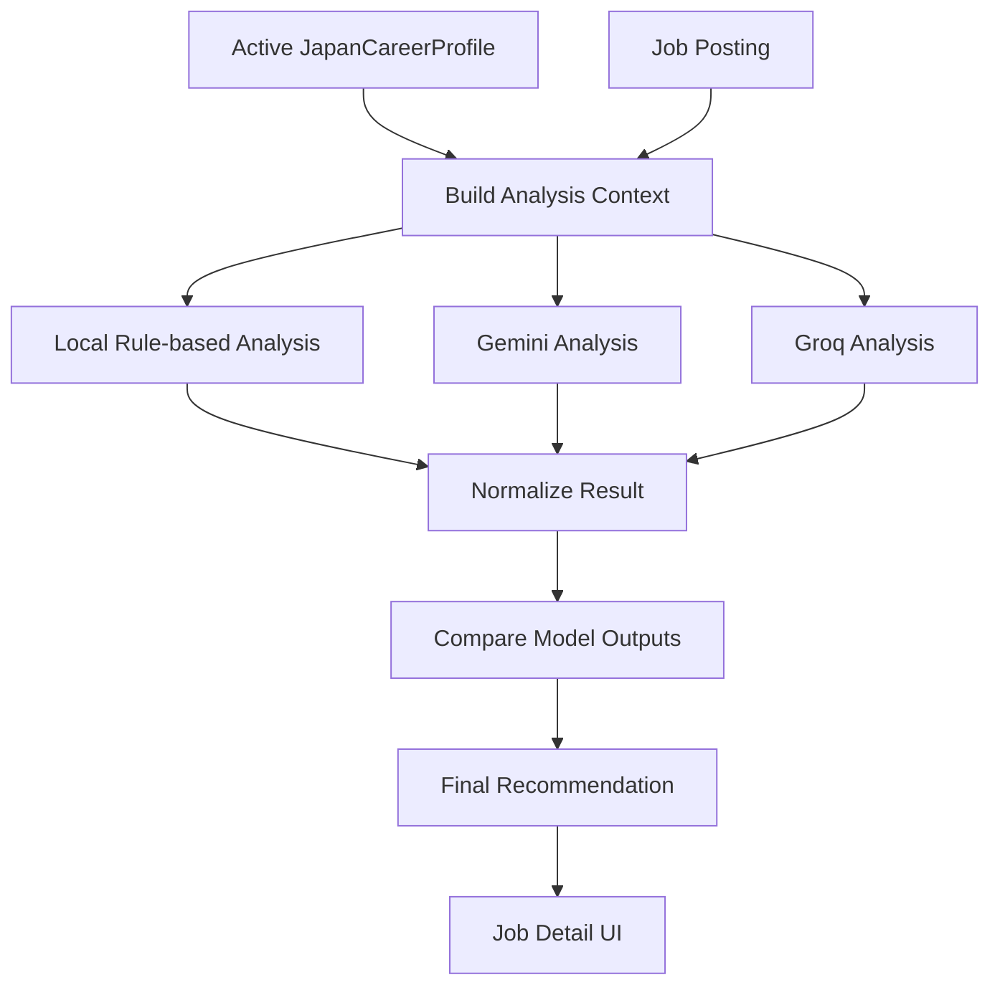
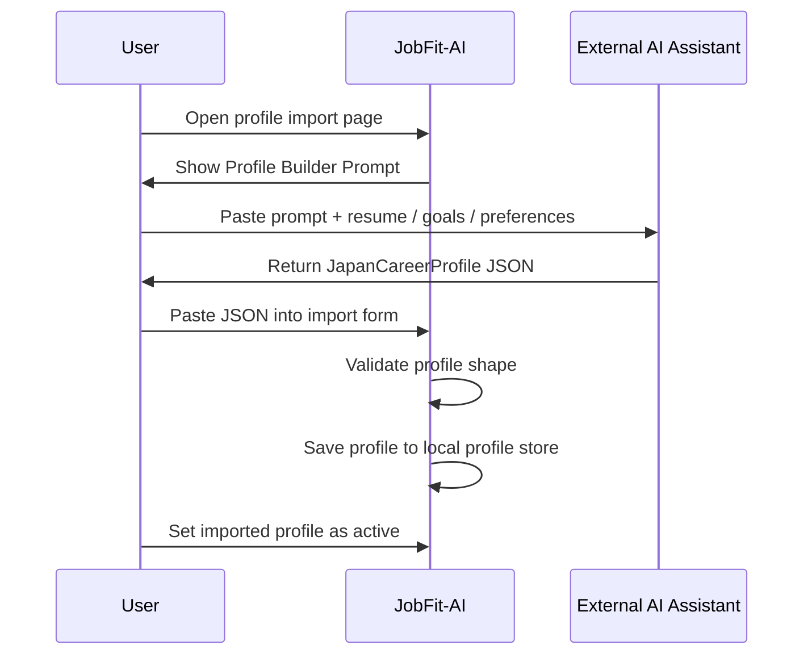
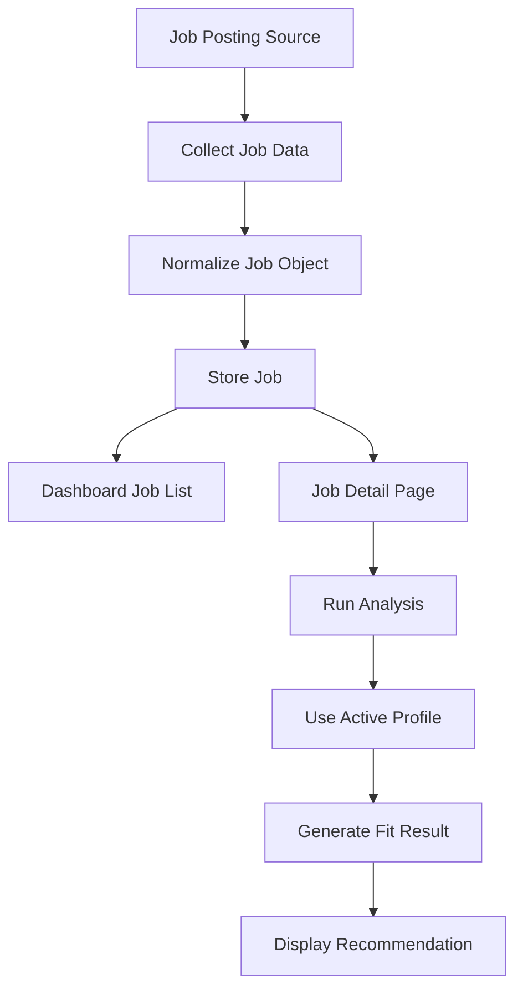
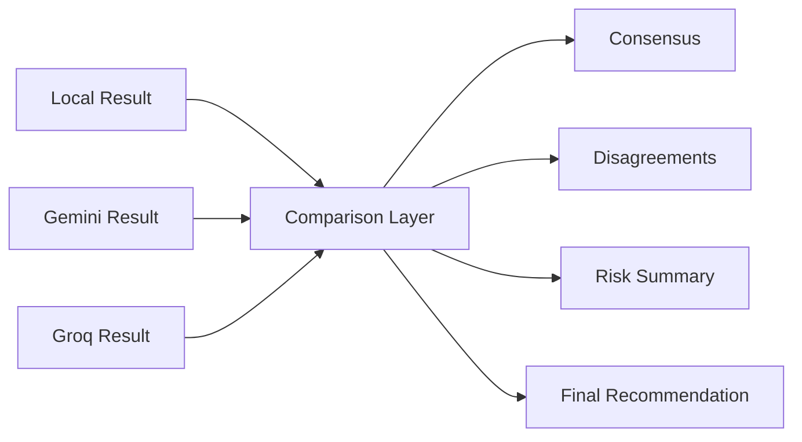

# JobFit-AI Architecture

This document describes the current architecture of JobFit-AI, with a focus on the profile-driven analysis flow.

JobFit-AI is a portfolio MVP for evaluating Japanese job postings against a structured career profile.

The core architectural principle is:

```text
Active Career Profile + Job Posting = Context-aware Fit Decision
```

---

## 1. System Overview

JobFit-AI is structured around four main areas:

1. **Job collection and storage**
2. **Career profile management**
3. **Profile-driven analysis**
4. **Result presentation and decision support**

At a high level:



---

## 2. Profile-driven Architecture

The most important part of the system is the active `JapanCareerProfile`.

Rather than analyzing every job in a generic way, JobFit-AI evaluates job postings against the active profile (selected in `/profiles` and read from browser `localStorage` via `src/lib/profile/profileStore.ts`).

A profile may include:

- Target roles and preferred keywords
- Desired locations and industries
- Employment type preferences
- Minimum salary
- Japanese and English level
- Visa support needs
- Work style preference
- Overtime, shift work, night shift, and transfer tolerance
- Values, deal breakers, and risks to avoid
- Strengths and transferable skills
- Long-term career goals

This allows the same job to produce different recommendations under different profiles.

Example:

```text
Job: Tokyo IT Helpdesk

Profile A: Fukuoka Hospitality
Result: Weak or mixed fit

Profile B: Tokyo IT Support
Result: Stronger fit

Profile C: Remote Bilingual Operations
Result: Possible but depends on remote flexibility
```

---

## 3. Profile-driven Analysis Flow



The active profile is converted into analysis context (`profileToAnalysisContext` in `src/lib/profile/profileContext.ts`) and passed into the analysis process. The detail UI sends the active profile in the request body when calling analyze APIs.

Analysis endpoints (server-side, writing results back to `jobs_temp.json`):

| Provider | Route |
| --- | --- |
| Local | `POST /api/jobs/[id]/analyze` |
| Gemini | `POST /api/jobs/[id]/analyze/deep` |
| Groq | `POST /api/jobs/[id]/analyze/groq` |

The analyzer can then reason about:

- Whether the job matches the user's target role
- Whether the location is acceptable
- Whether the salary meets the user's minimum expectations
- Whether the employment type is acceptable
- Whether visa support is needed
- Whether the posting includes deal breakers
- Whether the role supports the user's long-term direction

---

## 4. External AI Profile Import Flow

JobFit-AI intentionally avoids requiring users to upload raw resumes directly into the app.

Instead, it uses an external AI profile-building workflow on `/profiles/import`.



The Profile Builder Prompt is `PROFILE_BUILDER_PROMPT_ZH` (`src/lib/profile/profilePrompt.ts`). Imported JSON must match the `JapanCareerProfile` schema (`version: japan_career_profile_v1`).

Benefits of this workflow:

- The app does not need to store raw resume content.
- The user can choose their preferred AI assistant.
- The process is model-agnostic.
- The generated profile is structured and reusable.
- The analysis system receives a clean decision baseline.

---

## 5. Job Collection and Analysis Flow

Jobs are added through `POST /api/collect` (for example from a Chrome Extension or any HTTP client with the same JSON payload). The home page loads jobs via `GET /api/jobs`.

A simplified flow:



Jobs and stored analysis outputs persist in `jobs_temp.json` on the server (read/written with Node `fs` from API routes and the job detail server page). Profile persistence stays in the browser.

In the current MVP, this split is intentional. The project prioritizes validating the decision-support workflow over building a production database.

---

## 6. Multi-model Analysis Strategy

JobFit-AI uses multiple analysis sources:

1. **Local analyzer** — `src/lib/analysis/` (rule-based, no API key)
2. **Gemini analyzer** — deep route, requires `GEMINI_API_KEY`
3. **Groq analyzer** — groq route, requires `GROQ_API_KEY`

Each analyzer has a different role.

### Local Analyzer

The local analyzer is useful for deterministic checks:

- Location match
- Role and keyword match
- Employment type match
- Salary floor
- Japanese level
- Visa support
- Deal breaker detection
- Night shift / shift work / transfer risks

### AI-based Analyzers

Gemini and Groq use a shared compact digest input pipeline for language-heavy reasoning:

- Long job description interpretation
- Hidden risk detection
- Career-direction reasoning
- Explaining trade-offs
- Summarizing nuanced recommendations

### Comparison Layer

The comparison layer (`buildAnalysisComparison` in `src/lib/analysis/compareAnalysis.ts`) turns individual model outputs into a more useful decision. It is **read-only**: it consolidates results already saved on the job record and does not call any AI API.



The goal is not to blindly trust one model, but to expose:

- Areas of agreement
- Areas of disagreement
- Important risks
- Practical next actions

Per-provider fit levels use `excellent`, `good`, `fair`, `poor`, and `unknown`. Model-comparison consensus (when enough analyses exist) uses `strong_apply`, `apply_with_checks`, `consider`, `not_priority`, and `insufficient`.

---

## 7. Data Storage Strategy

The MVP uses lightweight persistence suitable for a portfolio project.

Typical data categories:

```text
Profiles (browser localStorage)
- JapanCareerProfile objects
- Active profile ID
- Profile store metadata (ProfileStore)

Jobs (server jobs_temp.json)
- Job posting information
- Source / URL if available
- Application status
- Collected date

Analysis Results (on each job record in jobs_temp.json)
- localAnalysis / deepAnalysis / groqAnalysis (canonical flat per-provider keys)
- Deprecated back-compat keys read but never written: `analysis` (old local key),
  `aiScore` (the mock /score route + ScorePanel were removed in Phase 1)
- Fit score, recommendation, reasons, risks
- Final comparison result (computed in UI from stored outputs)
```

Profiles are stored client-side for fast iteration and privacy-friendly local testing. Jobs and analysis results live in `jobs_temp.json` on the machine running Next.js.

A reference seed file `user_profile.json` at the project root documents default candidate preferences for development; runtime profile data comes from `localStorage`, not that file.

This keeps the system simple and avoids adding login, accounts, or cloud synchronization too early.

---

## 8. UI Information Architecture

The UI is designed around decision clarity. Primary copy is Traditional Chinese.

### Dashboard (`/`)

The dashboard focuses on comparison and tracking:

- Job list
- Stats cards
- Search
- Status filter tabs
- Score and risk filters, sort options
- Status badges
- Fit score / recommendation summary when available

### Job Detail Page (`/jobs/[id]`)

The job detail page is conclusion-first. Current layout order:

1. Job title header and application status badge
2. Active profile banner (`ActiveProfileBanner`)
3. **Analyze Fit panel** — final recommendation, scores, reasons, risks, per-provider tabs, and model comparison (`AnalyzeFitPanel`)
4. Status selector
5. Job overview (structured fields when present)
6. **Original job posting** — collapsed by default (`<details>`)

The goal is to reduce cognitive load and avoid forcing the user to read the full job posting before seeing the decision.

---

## 9. Current Boundaries

JobFit-AI is currently a portfolio MVP.

It intentionally avoids some production features:

- No required user account system
- No cloud profile synchronization
- No automatic resume upload pipeline
- No production database requirement
- No guaranteed legal/career correctness
- No full job-board integration inside the main app
- Chrome Extension source is not in this repository (only the collect API contract)

The project focuses on the core decision-support loop:

```text
Profile -> Job -> Analysis -> Recommendation -> Human decision
```

---

## 10. Future Architecture Ideas

Possible future improvements:

- Cloud database for authenticated users
- Encrypted profile storage
- Built-in resume parser
- Built-in Japan career questionnaire
- AI provider fallback layer
- Job alert email parser
- Browser extension packaged or linked from this repo
- Exportable analysis reports
- Demo data / sample scenarios
- Full multilingual prompt and UI support

---

## 11. Design Principles

### 1. Profile as Source of Truth

The profile defines what "fit" means for the user.

### 2. Human-in-the-loop

The app supports decisions but does not make final decisions for the user.

### 3. Explainability

A recommendation should include reasons, risks, and suggested actions.

### 4. Privacy-aware by default

The external AI import flow avoids storing raw resume content inside the app.

### 5. Small MVP, clear architecture

The system starts with local-first storage (profiles in the browser, jobs on disk) and can evolve into a more production-ready architecture later.

---

## 12. Summary

JobFit-AI is built around a profile-driven decision loop:

```text
Create Profile
      ↓
Add Job Posting
      ↓
Analyze Against Active Profile
      ↓
Compare Model Outputs
      ↓
Show Final Recommendation
      ↓
User Decides Whether to Apply
```

This architecture makes the app more than a generic job description analyzer.

It becomes a reusable career decision-support system.
